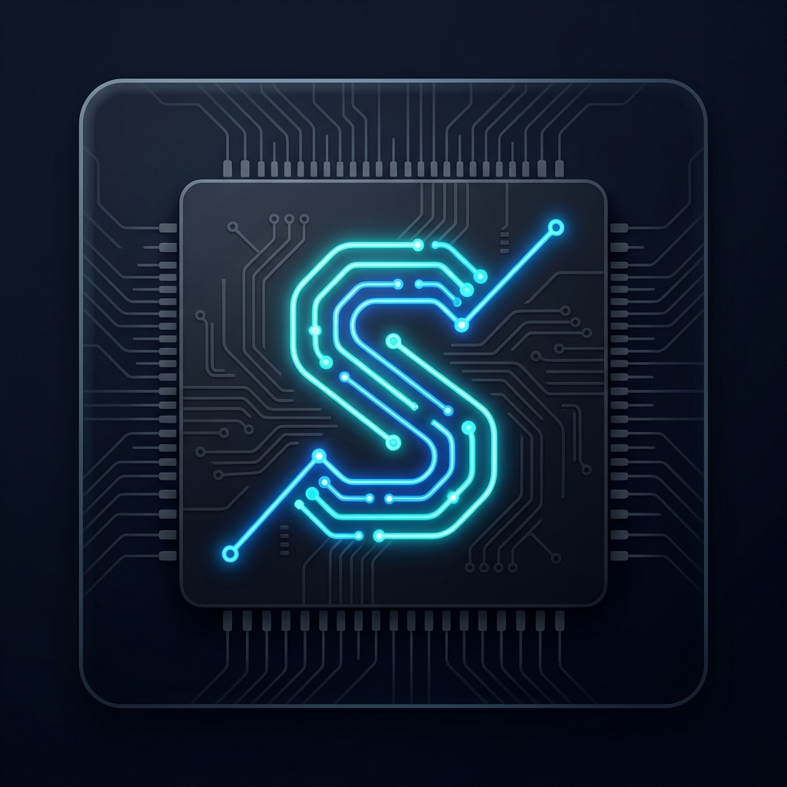

 <div align="center">
  
  
  # SQGATE
  **Free Online Digital Logic & Circuit Simulator**
  
  [](https://sqgate.online)
  [](https://opensource.org/licenses/MIT)
  [](#)
</div>

<br />

SQGATE is a completely free, privacy-first, client-side digital logic circuit simulator built specifically for computer science and electrical engineering students. Design, simulate, and debug complex digital architectures directly in your web browser with zero server latency.

👉 **[Launch Simulator (Live Demo)](https://sqgate.online)**

---

## ⚡ Key Features

- **Real-Time Simulation:** Instant propagation of signals (0s and 1s) with visually glowing wires.
- **Custom Integrated Circuits (ICs):** Encapsulate complex logic blocks into single, reusable custom gates.
- **Waveform Analyzer:** Built-in oscilloscope to monitor signal timing and trace logic glitches.
- **Client-Side Architecture:** Zero database latency. The entire engine runs in your browser using local storage.
- **Offline & PWA Ready:** Install SQGATE directly onto your desktop or phone as a Progressive Web App.
- **Privacy-First:** We do not collect or store your personal data. 

---

## 🤖 Anonymous AI Telemetry (For ML Training)

SQGATE features a built-in telemetry engine designed to collect **anonymous structural circuit data** to train future Large Language Models (LLMs) and Artificial Intelligence coding assistants on digital logic design.

- **How it works:** When users build circuits as a "Guest", the engine extracts the mathematical topology of the circuit (gate types, connections, and coordinates) and pushes it to an open Supabase backend.
- **Strict Privacy:** This data is 100% anonymous. It contains no IP addresses, emails, or personal identifiers.
- **Opt-Out:** If a user logs into the simulator using an email address, the telemetry engine is strictly bypassed and zero data is collected.

---

## 🛠️ Components Included

| Logic Gates | Inputs / Outputs | Advanced |
| :--- | :--- | :--- |
| AND, OR, NOT | Toggle Switches | D-Flip Flops |
| NAND, NOR, XOR, XNOR | Push Buttons | Clocks (1Hz - 100Hz) |
| Buffers & Tristates | LEDs & 7-Segment Displays | Custom IC Builder |

---

## 💻 Local Development Setup

Because SQGATE is a pure vanilla HTML/JS/CSS application without complex build tools, contributing or running it locally is incredibly simple.

1. **Clone the repository:**
   ```bash
   git clone https://github.com/YASHKHEBADE/SQGATE.git
   ```
2. **Open the App:**
   Simply double-click `index.html` to open it in your default web browser. No `npm install` or local server required!

---

## 🤝 Contributing
We welcome contributions from the engineering community! If you want to add a new logic gate, fix a bug, or improve the UI:
1. Fork the Project
2. Create your Feature Branch (`git checkout -b feature/AmazingFeature`)
3. Commit your Changes (`git commit -m 'Add some AmazingFeature'`)
4. Push to the Branch (`git push origin feature/AmazingFeature`)
5. Open a Pull Request

## 📚 Documentation
For complete technical and product documentation, please see the [/docs](./docs) directory which includes:
- [Product Requirement Document (PRD)](./docs/PRD.md)
- [Technical Requirement Document (TRD)](./docs/TRD.md)
- [Application Flow](./docs/APP_FLOW.md)
- [UI/UX Brief](./docs/UI_UX_BRIEF.md)
- [Typography & Fonts](./docs/TYPOGRAPHY_FONTS.md)
- [Backend Schema](./docs/BACKEND_SCHEMA.md)
- [Future Implementation Plan](./docs/IMPLEMENTATION_PLAN.md)

---

## 🚀 Recent Updates
- **SEO Optimization:** Added comprehensive OpenGraph, Twitter card, and meta tags to the root domain.
- **UI Enhancements:** Shifted the "Get SQGATE Pro" button cleanly into the dashboard navigation bar.
- **Mobile Experience:** Fixed the overlapping button glitch on the mobile portrait "Force Landscape" overlay.
- **Toolbar Cleanup:** Simplified button texts (e.g., "Save Image" to "Save") for a cleaner interface.

---

## 📄 License
Distributed under the MIT License. See `LICENSE` for more information.

<div align="center">
  <i>Built for the engineers of tomorrow.</i>
</div>
